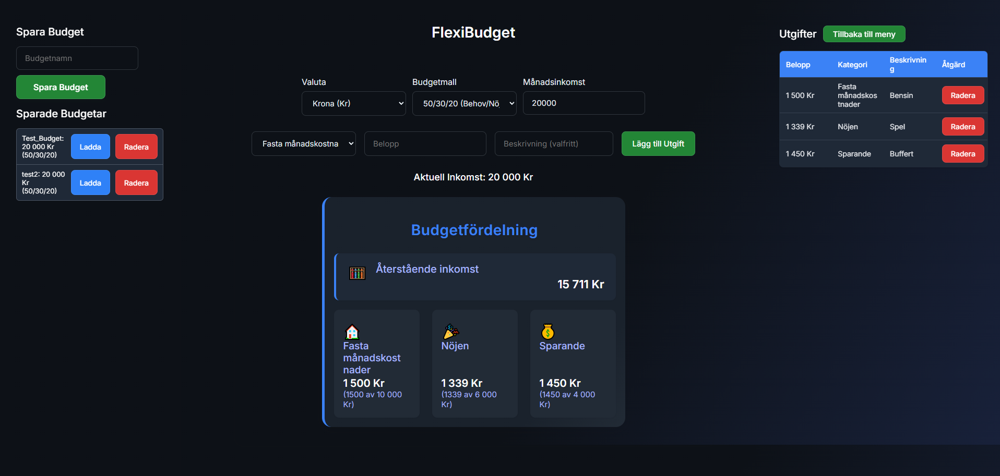
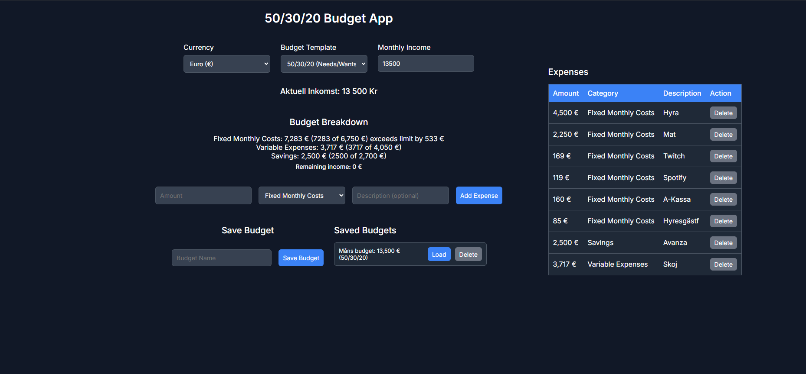

# 💸 FlexiBudget

A modern, flexible web application for managing your personal finances with customizable budget plans. FlexiBudget empowers you to take control of your money, visualize your spending, and save smarter no matter your financial goals or style.

---

## 🌟 Features

- **Flexible Budget Templates:** Choose from 50/30/20, 70/20/10, or create your own custom allocation
- **Real-Time Budget Insights:** Instantly see your budget breakdown, category limits, and remaining income
- **Expense Tracking:** Add, edit, and delete expenses in an interactive, user-friendly table
- **Snapshot System:** Save and load budget snapshots to track your progress or compare different months
- **Multi-Currency & Language:** Supports SEK, USD, EUR and both Swedish & English for a global experience
- **Modern, Responsive UI:** Clean, intuitive design that works beautifully on desktop and mobile

---

## 🚀 How to Use

1. **Enter your monthly income** and select your preferred currency (SEK, USD, or EUR)
2. **Pick a budget plan** (50/30/20, 70/20/10, or Custom Allocation) to match your financial style
3. **Add your expenses** (e.g., rent, groceries, entertainment) and watch your budget update in real time
4. **Save budget snapshots** to revisit your financial progress or compare different scenarios

---

## 🛠 Tech Stack

- **Frontend:** HTML, CSS, JavaScript (Vanilla)
- **Backend:** Node.js, Express.js
- **Database:** MongoDB

---

## 📸 Screenshots

  

